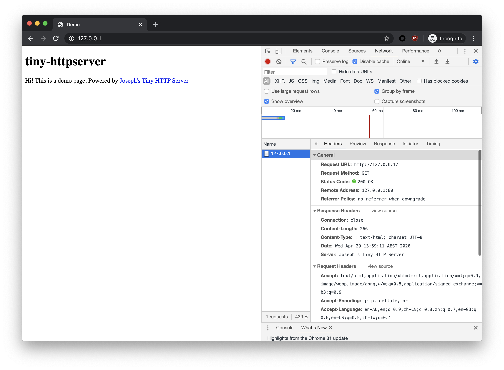

# tiny-httpserver
一个用Java NIO写的玩具HTTP服务器

## 代码启动
``` java
    public static void main(String[] args) {
        InetSocketAddress address = new InetSocketAddress(Config.PORT);
        HttpServer server = new HttpServer(address);
        try {
            server.init();
            server.start();
        } catch (IOException e) {
            e.printStackTrace();
        }
    }
```

## 打包并运行
### 打包
```
mvn clean
mvn package
```
### 运行
```
java -jar HttpServerStarter.jar
OR
java -jar HttpServerStarter.jar <port> <www root path>
```

## 截图
